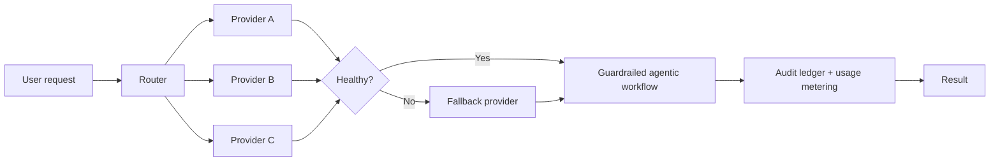

# Full-stack AI platform with multi-provider routing

**Role:** AI Systems Architect
**Context:** Production AI platform supporting writing, media generation, and production-planning workloads.

## The problem

Relying on a single AI provider means a single point of failure: outages, degraded quality, and cost spikes all land directly on the user. Different workloads also have different needs — what drafts copy well doesn't necessarily plan production runs well.

## What I built

- **Multi-provider routing layer** — requests are routed across providers based on workload type, with automatic **fallbacks** when a provider fails or degrades. No single outage takes the platform down.
- **Agentic workflows with guardrails** — autonomous multi-step workflows for content and planning tasks, wrapped in risk controls and cost management so automation executes without running wild.
- **Trust tooling** — audit ledgers that record what the AI did and why, plus usage metering, giving the system the credibility serious buyers expect.

## Outcome

A production platform that stays up when providers don't, keeps automation costs predictable, and gives buyers a verifiable record of AI behavior — the difference between a demo and something an enterprise will actually sign off on.
