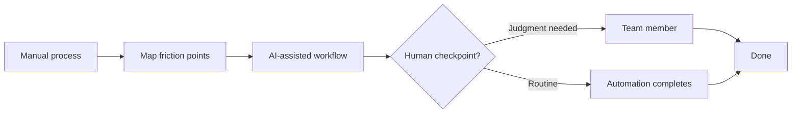

# Operational AI automation inside a real business

**Role:** Director of AI Implementation
**Context:** Put AI to work inside a real operating business — not a lab, not a demo.

## The problem

Day-to-day operations ran on manual work: repetitive data handling, follow-ups, and process steps that ate hours every week but never quite justified a full-time hire to fix.

## What I built

- **Operational workflow automation** — mapped the highest-friction manual processes and rebuilt them as AI-assisted workflows with human checkpoints where judgment actually mattered.
- **Guardrails for a non-technical team** — the people using these workflows weren't engineers, so every automation was designed to fail safe and surface clearly when it needed a human.
- **Adoption, not just deployment** — worked directly with the team to integrate the workflows into how they already worked, instead of dropping tools on them.

## Outcome

Manual workload cut by roughly **30%** — measured in hours returned to the team each week, inside a business that had to keep running while the automation went in.
