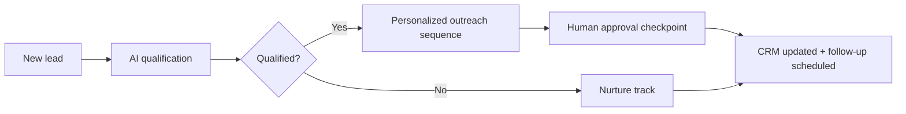

# AI-powered sales, CRM, and outreach systems

**Role:** AI Workflow Architect / Automation Consultant (via Garden State Concentrate)
**Context:** Client-facing consulting work — AI systems that had to pay for themselves.

## The problem

Small and mid-size businesses were doing outreach and follow-up by hand: inconsistent cadence, leads slipping through, and no clean connection between marketing activity and the CRM.

## What I built

- **AI-assisted outreach systems** — personalized, automated outreach sequences tied directly into the client's CRM, so no lead went cold from neglect.
- **Sales workflow automation** — lead intake, qualification, and follow-up routing rebuilt around AI drafting with human approval at the key moments.
- **Missed-call text-back and re-engagement flows** — captured the opportunities that used to vanish after hours.

## Outcome

Campaign efficiency lifted by up to **40%** across client engagements — more conversations started per hour of human effort, with the CRM finally reflecting reality.
